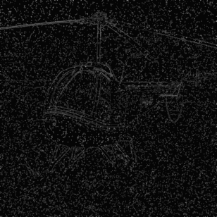
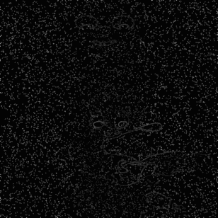
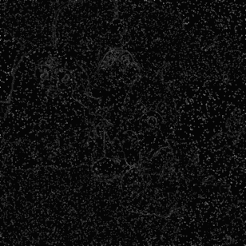
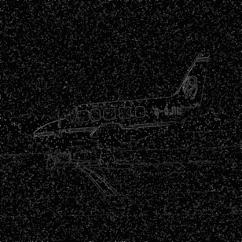

# PDE Image Denoising - Perona-Malik Diffusion

A Python implementation of the Perona-Malik anisotropic diffusion algorithm for image denoising using partial differential equations. Includes evaluation on multiple noise types (Gaussian, salt-and-pepper, speckle).

## Visualizations

The following animations demonstrate the iterative diffusion process on sample images, showing how noise is progressively reduced while preserving edges:

<table>
  <tr>
    <td align="center">
      <br>
      <em>Sample 1: Gaussian noise reduction</em>
    </td>
    <td align="center">
      <br>
      <em>Sample 2: Salt-and-pepper noise reduction</em>
    </td>
  </tr>
  <tr>
    <td align="center">
      <br>
      <em>Sample 3: Speckle noise reduction</em>
    </td>
    <td align="center">
      <br>
      <em>Sample 4: Multi-noise denoising</em>
    </td>
  </tr>
</table>

## Overview

This project implements the Perona-Malik diffusion model, an edge-preserving image denoising technique that uses anisotropic diffusion to reduce noise while maintaining important image features. The algorithm is evaluated on noisy image datasets to quantify PSNR and SSIM improvements.

## Features

- **Edge-preserving denoising**: Reduces noise while keeping edges sharp via anisotropic diffusion
- **Multi-noise support**: Handles Gaussian, salt-and-pepper, and speckle noise
- **Metrics tracking**: Computes PSNR and SSIM before and after denoising
- **Structured data pipeline**: `ImageSample` class encapsulates image triplets (original, noisy, denoised) and metrics
- **Batch processing**: Process multiple images with automatic metrics aggregation

## Installation

### Prerequisites
- Python 3.8+
- NumPy
- Pillow / imageio
- Kaggle API (for dataset download)
- SciPy (for Gaussian filtering)

### Setup

```bash
# Clone the repository
git clone <repository-url>
cd PdeImageDenoising

# Create virtual environment (recommended)
python -m venv .venv
source .venv/bin/activate  # On Windows: .venv\Scripts\activate

# Install dependencies
pip install -r requirements.txt

# (Optional) Install package in editable mode
pip install -e .
```

## Usage

### Basic Example

```python
from utils.functions import download_dataset, load_images, build_samples, apply_diffusion, summarize
from utils.constants import ORIGINAL_IMAGE_PATH, GAUSSIAN_NOISE_PATH

# Download dataset (first run only)
download_dataset()

# Load images
originals = load_images(ORIGINAL_IMAGE_PATH, max_images=10)
noisy_images = load_images(GAUSSIAN_NOISE_PATH, max_images=10)

# Build samples with before-denoising metrics
samples = build_samples(originals, noisy_images, noise_type="gaussian")

# Apply Perona-Malik diffusion
apply_diffusion(samples, lambda_=20.0, sigma=1.0, stepsize=0.2, n_steps=20)

# Print results
summarize(samples)
```

### Run Full Pipeline

```bash
python src/main.py
```

This processes all noise types (Gaussian, salt-and-pepper, speckle) and prints averaged metrics per noise type.

## Dataset

The project uses an open Kaggle dataset with pre-corrupted images:
- **Original images**: Clean reference images
- **Noisy variants**: Same images with Gaussian, salt-and-pepper, and speckle noise applied

Dataset structure:
```
data/dataset/
├── original/               # Clean images
└── noises/
    ├── gaussian/          # Gaussian-noise images
    ├── salt_and_pepper/   # Salt-and-pepper noise images
    └── speckle/           # Speckle noise images
```

## How It Works

### Algorithm Steps

1. **Load Dataset** - Download and cache images from Kaggle
2. **Convert to Grayscale** - Transform RGB images to single-channel format
3. **Build Samples** - Create `ImageSample` objects pairing original with noisy images
4. **Compute Noisy Metrics** - Calculate PSNR and SSIM before denoising
5. **Apply Diffusion** - Run Perona-Malik algorithm for specified iterations
6. **Compute Denoised Metrics** - Calculate PSNR and SSIM after denoising
7. **Summarize Results** - Aggregate and display metrics per noise type

### Perona-Malik Diffusion

The core PDE is:
```
∂u/∂t = div(g(|∇u_σ|) ∇u)
```

Where:
- `u` is the image
- `g(·)` is an edge-stopping function
- `σ` controls the pre-smoothing before gradient computation

## Project Structure

```
PdeImageDenoising/
├── src/
│   ├── main.py                          # Main entry point
│   ├── pmdiffusion.py                   # Perona-Malik implementation
│   ├── datatype.py                      # ImageSample dataclass
│   ├── utils/
│   │   ├── functions.py                 # Pipeline functions
│   │   └── constants.py                 # Paths and constants
│   └── matlab_version/                  # Reference MATLAB implementation
├── data/
│   └── dataset/                         # Image datasets (auto-populated)
├── README.md                            # This file
├── requirements.txt                     # Dependencies
└── pyproject.toml                       # Project configuration
```

## Results

The algorithm achieves significant noise reduction while preserving edge details. Example metrics:

| Noise Type      | Before SSIM | Before PSNR | After SSIM | After PSNR |
|-----------------|-------------|-------------|-----------|------------|
| Gaussian        | 0.XX        | XX.XX dB    | 0.YY      | YY.YY dB   |
| Salt-and-Pepper | 0.XX        | XX.XX dB    | 0.YY      | YY.YY dB   |
| Speckle         | 0.XX        | XX.XX dB    | 0.YY      | YY.YY dB   |

## Contributing

Contributions are welcome! Areas for improvement:
- Performance optimization (GPU acceleration)
- Alternative edge-stopping functions
- Comparison with other denoising algorithms
- Enhanced visualization tools

## License

[Specify license - e.g., MIT, Apache 2.0, etc.]

## References

- Perona, P., & Malik, J. (1990). "Scale-space and edge detection using anisotropic diffusion." IEEE Transactions on Pattern Analysis and Machine Intelligence, 12(7), 629-639.

